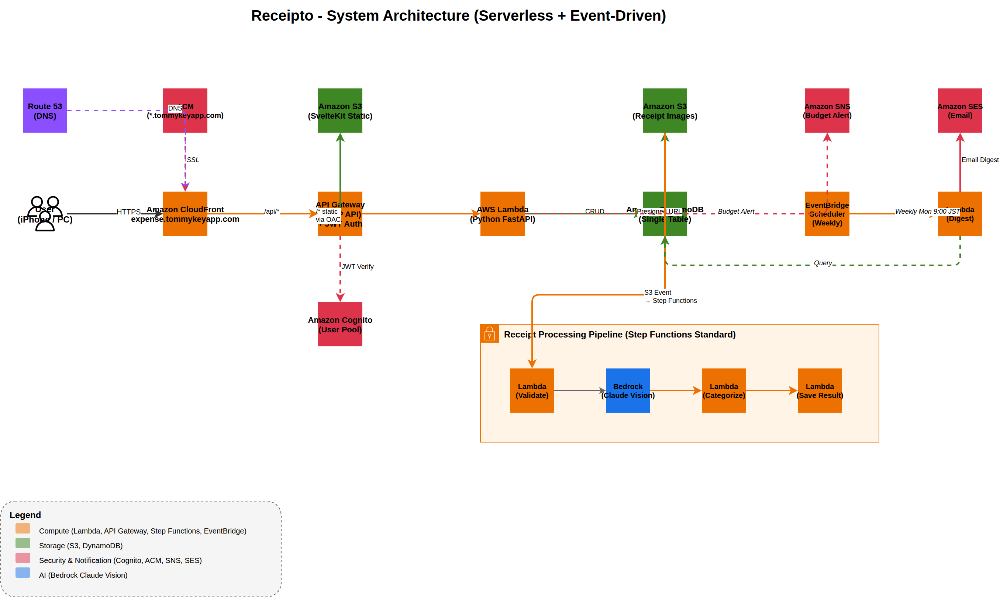

# Receipto

レシートを撮影するだけで支出を自動記録する家計簿アプリ。OCRで金額・店名を読み取り、カテゴリ自動分類、予算アラート、週次ダイジェストメールまで対応。

## 構成図



> [docs/architecture.drawio](docs/architecture.drawio) を draw.io で開くと編集できる

## 使った技術

| | |
|---|---|
| バックエンド | Python 3.12 + FastAPI (Lambda) |
| フロント | SvelteKit 2, Svelte 5, Tailwind CSS v4, shadcn-svelte |
| 認証 | Cognito (JWT, SRP認証) |
| DB | DynamoDB (シングルテーブル設計) |
| OCR | Bedrock Claude Vision (レシート画像 → 構造化JSON) |
| ワークフロー | Step Functions (Standard) |
| 通知 | SNS (予算アラート) + SES (週次ダイジェスト) |
| スケジューラー | EventBridge Scheduler |
| IaC | Terraform (S3バックエンド + DynamoDB state lock) |
| CI/CD | GitHub Actions + pnpm |
| 配信 | CloudFront (S3 + API Gateway を同一ドメインで配信) |

## 使ってるAWSサービス

| サービス | 何してるか |
|---------|-----------|
| Lambda | Python API + OCRパイプライン(4関数) + 週次ダイジェスト生成 |
| API Gateway | HTTPリクエストをLambdaにルーティング + Cognito JWT認証 |
| DynamoDB | 支出・レシート・カテゴリ・予算・月次集計の保存 |
| S3 | レシート画像 + フロントのビルド成果物 + Terraform state |
| CloudFront | CDN。S3とAPI Gatewayの前に立ってHTTPS配信 |
| Cognito | ユーザー登録、ログイン、JWT発行 (マルチユーザー対応) |
| Bedrock | Claude Visionでレシート画像からOCR（金額・店名・日付を構造化JSON抽出） |
| Step Functions | レシートアップロード → OCR → 分類 → レシートに結果保存のワークフロー |
| SNS | 予算超過時のメール通知 |
| SES | 週次ダイジェストメール送信 |
| EventBridge | S3アップロード→Step Functions起動 + 毎週月曜にダイジェスト生成 |
| Route 53 | カスタムドメイン (expense.tommykeyapp.com) のDNS管理 |
| ACM | SSL証明書 (*.tommykeyapp.com ワイルドカード) |
| IAM | LambdaにDynamoDB/S3/Bedrock等のアクセス権限を付与 |

## 機能

- ユーザー認証（サインアップ、ログイン、JWT）
- レシート撮影 → Claude Vision OCR自動解析（金額・店名・日付）
- HEIC画像の自動JPEG変換（iPhone対応）
- 画像自動圧縮（2048px/1MB、5MB超対応）
- アップロードプログレスバー + キャンセル
- OCR失敗時の手動入力フォールバック
- 支出の手動登録・削除（Undoトースト付き）
- カテゴリ自動分類（ルールベース）
- カテゴリ別予算設定 + 消化率プログレスバー
- 月次サマリー + カテゴリ別内訳
- 支出トレンド（過去N月の推移）
- 予算超過メールアラート（SNS）
- 週次ダイジェストメール（SES + EventBridge）

## ディレクトリ構成

```
receipto/
├── api/          # Python FastAPI (Lambda対応、Mangumでデュアルモード)
├── functions/    # Step Functions用Lambda (OCR, 分類, 通知等)
├── web/          # SvelteKit フロント（shadcn-svelte）
├── infra/        # Terraform（Cognito, DynamoDB, Lambda, Step Functions等）
├── docs/         # 構成図 (draw.io) + Swagger UI + OpenAPI spec
└── .github/      # GitHub Actions（CI/CD）
```

## API

Swagger UI: https://tommykey-apps.github.io/receipto/

| Method | Path | 何するか |
|--------|------|---------|
| POST | `/api/receipts/upload` | レシート画像アップロード用 presigned URL 発行 |
| GET | `/api/receipts/{id}` | レシート詳細（OCR結果含む） |
| GET | `/api/expenses` | 支出一覧（月・カテゴリでフィルタ可） |
| POST | `/api/expenses` | 支出の手動登録 |
| PUT | `/api/expenses/{id}` | 支出の編集 |
| DELETE | `/api/expenses/{id}` | 支出の削除 |
| GET | `/api/categories` | カテゴリ一覧 |
| POST | `/api/categories` | カスタムカテゴリ追加 |
| GET | `/api/summary/monthly` | 月次集計 |
| GET | `/api/summary/trend` | 過去N月のトレンド |
| GET | `/api/budgets` | 予算一覧 |
| PUT | `/api/budgets` | 予算設定 |

## ローカルで動かす

```bash
cp .env.example .env   # 初回のみ
make dev               # DynamoDB Local起動 + 案内表示
make api               # 別ターミナルでAPI起動 (localhost:8080)
make web               # 別ターミナルでフロント起動 (localhost:5173)
```

その他のコマンド:

```bash
make help              # 全コマンド一覧
make test              # 全テスト実行
make docs              # OpenAPI spec生成 + Swagger UI (localhost:9090)
make db-admin          # DynamoDB Admin UI (localhost:8001)
make clean             # 全停止
```

DEVモードではCognito認証をスキップするので、ログインなしでUI確認できる。

## デプロイ

mainブランチへのpushで自動デプロイ（GitHub Actions）。

```bash
cd infra && terraform apply   # 手動の場合
```

使い終わったら壊す。

```bash
cd infra && terraform destroy
```

## コストについて

サーバーレス構成なので、アクセスがなければほぼ $0。
DynamoDBはオンデマンドモード、Bedrockは使った分だけ課金。月額 $1〜4 程度。
