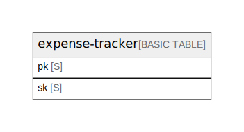

# Amazon DynamoDB (ap-northeast-1)

## Tables

| Name                                  | Attributes | Comment                                                                                                                                                                                                                                                                                                | Type        |
| ------------------------------------- | ---------- | ------------------------------------------------------------------------------------------------------------------------------------------------------------------------------------------------------------------------------------------------------------------------------------------------------ | ----------- |
| [expense-tracker](expense-tracker.md) | 2          | Single-table design. 6 logical entities (User / Expense / Receipt / Category / Budget / MonthlySummary) are stored under different SK prefixes. See ../entities.md and ../access-patterns.md for full attribute definitions (tbls cannot infer non-key attributes from DynamoDB).  | BASIC TABLE |

## Relations

---

> Generated by [tbls](https://github.com/k1LoW/tbls)
