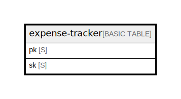

# expense-tracker

## Description

Single-table design. 6 logical entities (User / Expense / Receipt / Category /  
Budget / MonthlySummary) are stored under different SK prefixes.  
See ../entities.md and ../access-patterns.md for full attribute definitions  
(tbls cannot infer non-key attributes from DynamoDB).  

## Attributes

| Name | Type | Default | Nullable | Children | Parents | Comment                                                                                                                                                                                                                                                                |
| ---- | ---- | ------- | -------- | -------- | ------- | ---------------------------------------------------------------------------------------------------------------------------------------------------------------------------------------------------------------------------------------------------------------------- |
| pk   | S    |         | false    |          |         | Partition key. Always `USER#{cognito_sub}` — every item belongs to exactly one user.                                                                                                                                                                              |
| sk   | S    |         | false    |          |         | Sort key. Prefix determines the entity type:   EXP#{ISO8601}#{id}        Expense   RCV#{id}                  Receipt   CAT#{name}                Category   BDG#{YYYY-MM}#{category}  Budget   SUM#{YYYY-MM}             MonthlySummary  |

## Primary Key

| Name        | Type                       | Definition                                                                           |
| ----------- | -------------------------- | ------------------------------------------------------------------------------------ |
| Primary Key | Partition key and sort key | [{ AttributeName: "pk", KeyType: "HASH" } { AttributeName: "sk", KeyType: "RANGE" }] |

## Relations

---

> Generated by [tbls](https://github.com/k1LoW/tbls)
